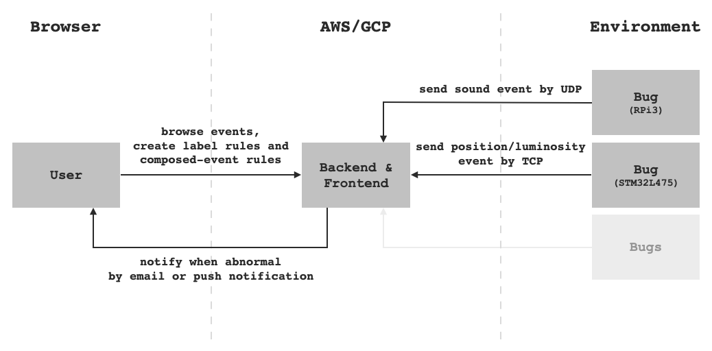

# BUG - Be Ur Guard

## Table of Contents

- [BUG - Be Ur Guard](#bug---be-ur-guard)
  - [Table of Contents](#table-of-contents)
  - [Why Making BUG](#why-making-bug)
  - [How BUG Works](#how-bug-works)
    - [BUG - Bug](#bug---bug)
    - [BUG - Backend](#bug---backend)
    - [BUG - Frontend](#bug---frontend)
  - [Proof of Concept](#proof-of-concept)
  - [To Improve](#to-improve)
  - [Credits](#credits)

## Why Making BUG

When it comes to home safety, security camera is always the top choice because for human it is easy to read the abnormal, however the recorded videos are hard for resource constrained devices to store or analyze at realtime. So BUG makes use of other sensor-able materials such as sound, position and luminosity to record signals from environment as events.

Most time a meaningful event for human is composed by multiple single-material events. For example, opening a door might be accompanied with:

- Specific Sound
- Different Position
- Different Luminosity

So BUG provides user an interface to define rule about how to label single-material events and how to compose the labelled events to be human readable ones as **composed events**.

## How BUG Works

BUG consists of 3 parts: Bug, Backend, Frontend.

### BUG - Bug

Bug represents the devices recording events. In this proof of concept, they are STM32L475 serving as position and lumixocity event recorder and RPi3 serving as sound event recorder.

For this proof of concept, we have two MCU serving as Bug

- STM32L475

  - Use acceleration sensor on it to detect whether self position has difference
  - Use photoresistor sensor to detect whether luminosity has difference (not yet implemented).
  - Send position, luminosity event to Backend through TCP

- RPi3

  - Use USB microphone to sense sound around it
  - Send sound event to Backend through UDP

### BUG - Backend

Backend serves as a TCP/UDP server for devices to report events, and as a RESTful API server for user at browser to interact.

### BUG - Frontend

Frontend serves web assets for browser to render. Users can browser the event history day by day, make label rules, composed events rules, and manage devices on it.

## Proof of Concept

## To Improve

- Implement luminosity tracker
- Implement auto event labelling
- Implement composed events composing
- Implement email notification and push notification
- Use TLS/DTLS between Bug and Backend
- Offline mode

## Credits

These awesome blogs help a lot.

- [Audio Processing for Dummies](https://adventures.michaelfbryan.com/posts/audio-processing-for-dummies)
